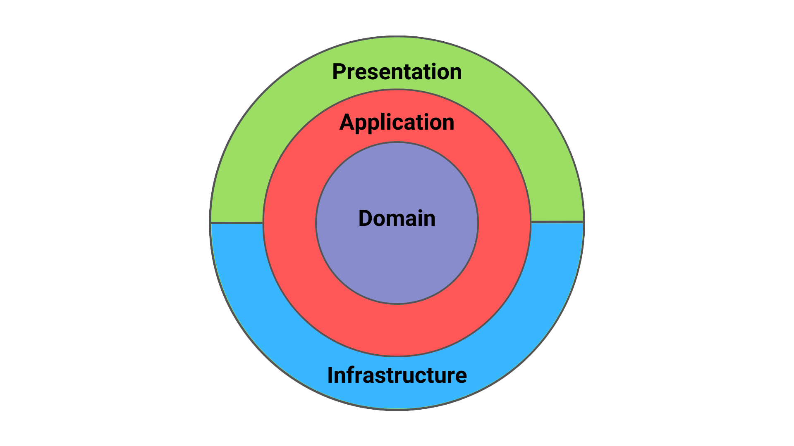

# DDD et CQRS via Mediator

Ceci est un projet démo, nom de code Bison, visant à implémenter une architecture logicielle reposant sur le Domain-Driven Design et CQRS via le pattern Mediator.

## Objectif 1
Réaliser 2 applications simples implémentant les principes énoncés : CsvWebservice, UserWebservice

### Architecture logicielle
Le suffixe "Domain" adossé aux différents projets fait écho au Domain Driven Design (cf. [Blue Book de Eric Evans](https://www.amazon.fr/Domain-Driven-Design-Tackling-Complexity-Software/dp/0321125215)). Une clean architecture a été mise en place avec un découpage et nommage clair par projet, en s'appuyant sur le pattern Mediator pour adopter une approche CQRS. Les namespaces et les noms des assemblies au build ont été ajustés pour embarquer le préfixe Bison.*. Les projets ont été renommés et l'arborescence de répertoires optimisée pour éviter de dépasser la limite de caractères dans la taille des paths de fichiers sous git en particulier sous Windows.

- Web : Interface technique HTTP de web API
- Application : Gestion de l'orchestration et implémentation des différentes interfaces, handlers et services
- Infrastructure : Implémentation des providers d'accès aux composantes infrastructures (ici database)
- Domain : le coeur métier isolé et borné, soit le domaine

### Tests unitaires
Des projets de tests unitaires NUnit ont été ajoutés pour chaque application, en s'appuyant sur FluentAssertions pour l'écriture des assertions et Bogus pour la génération de données de test.

### Feature
La feature principale d'Upload de CSV de l'application CsvWebservice correspond à une feature de Parsing avec réconciliation de l'existence d'un utilisateur via la web API UserWebservice. Les étapes d'écriture ont été les suivantes :
- Définition d'un domaine propre et lisible
- Implémentation MemoryCache du framework
	- Pas de réinvention de la roue
	- Logique de suppression/cleaning embarqué dans l'implémenation
- Fonction de Parsing
- Approche CachePreload au startup de l'application pour cacher l'ensemble des users connus
	- Paramétrable pour garder une alimentation au fil de l'eau possible
- Gestion correcte du Stream représentant le contenu de la requête
	- Traitement au fil de l'eau par ligne
	- Eviter de monter toute la data en mémoire (limiter les données montées en mémoire en streamant le contenu)
- Construction d'un résultat intelligible en sortie de web API : CsvParsedReport avec dictionnaire dynamique des clés valeurs du CSV fourni en entrée
- Paramétrisation de l'application via appsettings.json et IOptions<>
- Ajout d'un fichier de Resources pour l'internationalisation des messages de retour

## Objectif 2
Ajouter un rate limiter.

### Solution
Dans ce cadre précis, l'objectif est de s'appuyer sur une librairie existante même si une implémentation custom est envisageable, l'idée est encore une fois de ne pas réinventer la roue. Le Rate Limiting peut par ailleurs être géré au niveau infrastructure (NGINX, API Management, etc.).
Une gestion InMemory suffit ici et fonctionne également pour une application réelle en Production. Une approche RateLimiting distribuée en s'appuyant sur un cache distribué peut aussi être envisagée pour un scénario réel de production, impliquant N instances derrière un LoadBalander round-robin par exemple.
Côté package applicatif, 2 solutions envisageables :
| Description |Url  |
|--|--|
|Package connu et reconnu de la communauté .NET  couvrant des features de rate limiting|https://github.com/stefanprodan/AspNetCoreRateLimit  |
|RateLimiter Microsoft built-in disponible en preview depuis .NET7 |https://learn.microsoft.com/en-us/aspnet/core/performance/rate-limit|

Le RateLimiter built-in est choisi ici pour rester sur une fonction built-in du framework.
A noter que la feature du RateLimiting par IP (ou autre critère) par endpoint n'est pas encore supportée out-of-the-box.
### Configuration
Pour répondre au besoin, le RateLimiter est configuré comme suit :
- FixedWindow dans le temps, configurée selon les valeurs renseignées au niveau des appsettings
- Utilisation du principe de Partitions du RateLimiter built-in pour limiter le flux par IP
- Vérification de la présence du header "X-Forwarded-For" si jamais l'application est hostée derrière un Application Load-Balancer
- Possibilité de débrayer le RateLimiter par voie de configuration (`Enabled : false`)

## Objectif 3
Ajouter des fichiers de déploiements Kubernetes et de build d'images Docker.

### Solution
L'approche retenue dans le cadre de l'exercice est de s'appuyer sur Kustomize pour les fichiers de déploiements Kubernetes et Dockerfile pour assurer le build des images de chacune des 2 applications.
Un enpoint healthcheck a été rajouté pour la liveness probe.
Les appsettings par environnement sont montés via un volume sur les containers.

### Reste à faire pour un scénario en conditions réelles
- Exposer le service CSV au travers d'un ingress controller
- Ajouter le binding HTTPS
- Challenger l'usage de Helm pour assurer le déploiement à la place de kustomize
- Basculer sur Flux ou ArgoCD pour inverser la reponsabilité du déploiement / mises à jour
- Exploiter les namespaces pour cloisonner logiquement les ressources, en particulier si 1 cluster cumule plusieurs environnements
- Implémenter des network policies pour cloisonner les flux entre pods
- Assurer la CI/CD au travers des workflows Github Actions
- Scan de vulnérabilités des images produites
- Etablir une stratégie de versioning des applications et des images
- Définir une readiness probe pour le CsvWebservice, en particulier pour déterminer quand celui-ci a terminé de charger le cache par exemple
- Définir une base commune pour les appsettings et exploiter les appsettings.`env`.json par environnement ne contenant que le différentiel propre à chaque environnement

# TODO global
- Finir les tests unitaires / Implementer des tests end-to-end (avec la couche WebAPI)
- Gestion d'erreur/exception un peu plus complète
- Ajouter plus d'instructions de logs et une encapsulation dans du log structuré embarquant des metadata de contexte par défaut
- Ajouter swagger
- Ajouter une authentification + autorisation sur les web API (AuthenticationHandler<>)
- Commentaires de code
- S'appuyer sur un cache distribué
- S'appuyer sur une architecture event-driven pour l'alimentation du cache, gérée par un backgroud worker asynchrone
- Implémenter les pipelines GitHub actions
